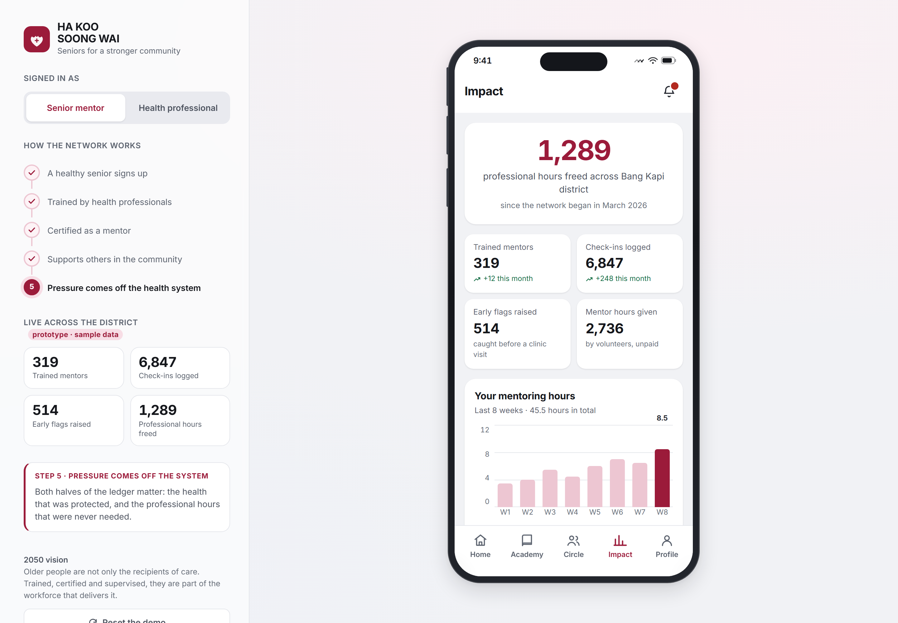
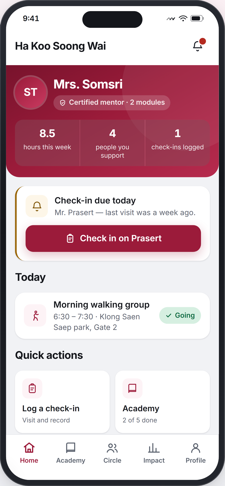
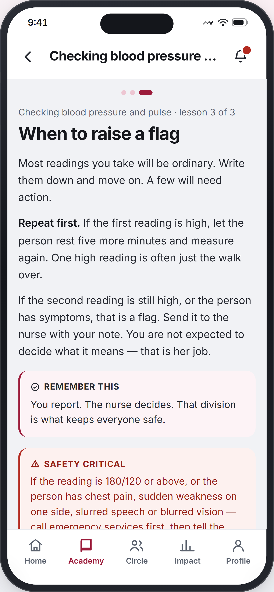
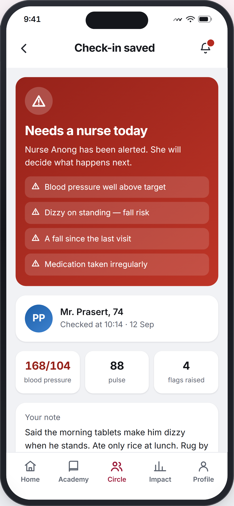
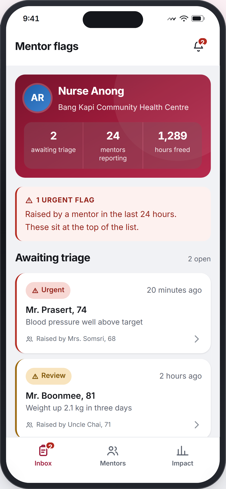

# Ha Koo Soong Wai — the senior mentor network

A working prototype of the 2050 vision: **healthy older adults are trained and
certified by community health professionals, then support other older adults as
peer health mentors.** Older people stop being only the recipients of care and
become part of the system that delivers it.

This is the senior-mentor side of the **Ha Koo Soong Wai** platform. The other
side matches young volunteers with isolated elderly neighbours; this side changes
who the volunteer is, and adds the clinical spine that lets a health service rely
on them.

**[Open the live prototype →](https://xuande268.github.io/ha-koo-soong-wai/)**



<p align="center">
  
  
  
  
</p>

## Open it

Double-click **`index.html`**. That is the whole app: one self-contained file, no
server, no build step, no network calls. Everything you do is stored in your own
browser only.

## What to try (the demo path)

1. **Home → Academy.** Open *Checking blood pressure and pulse*, read the three
   lessons, take the quiz, pass, and get a certificate signed by Nurse Anong.
   Your profile and home screen now say "Certified mentor".
2. **Circle → Mr. Prasert → Log a check-in.** Raise the systolic reading above 160,
   report dizziness on standing and a fall, then submit. The app applies the
   clinic's own thresholds and returns a critical verdict.
3. **Send it to Nurse Anong.** Watch the badge appear on the bell.
4. **Switch to the health professional view** (left panel, or Profile). Mr.
   Prasert's flag is at the top of the inbox with your note in it. Triage it.
5. **Switch back.** Open Mr. Prasert — the nurse's decision is on his record. The
   loop is closed.

The four counters in the left panel move as you go; the five-stage loop lights up
with the stage you are on.

## Files

| File | What it is |
|---|---|
| `index.html` | **The deliverable.** Self-contained, double-click to run. |
| `artifact.html` | Same content minus the document wrapper, for hosting as a web page. |
| `PROMPT.md` | The build prompt that specifies this app from scratch. |
| `PITCH.md` | How to present it to judges: script, demo order, and prepared answers. |
| `src/styles.css` | Design tokens and the whole design system. |
| `src/data.js` | All seed content: curriculum, lesson text, quiz questions, seniors, activities, escalation data, panel narration. |
| `src/app.js` | State, hash router, screens, actions, triage rules. |
| `src/shell.html` | The document shell with the CSS/JS injection markers. |
| `build.js` | Inlines `src/` into `index.html` and `artifact.html`. |
| `verify.js` | Headless verification harness (see below). |
| `shots.js` | Captures every screen as an image for visual review. |

Edit anything in `src/`, then:

```
node build.js
```

## Verification

`verify.js` drives headless Chrome over the DevTools Protocol — no dependencies,
since Node 24 ships `fetch` and `WebSocket`.

```
node verify.js          # measure
node shots.js           # capture every screen to shots/
node verify.js --shots  # measure and capture
```

It launches Chrome and runs three passes — the full golden path (certify → check
in → escalate → triage → confirm the reply reaches the mentor), a secondary pass
over the other things a judge will click (matching, joining a group, logging a
session, the text-size control, the notification bell, the demo reset), and a
walk of all 21 routes — then asserts:

- every route actually rendered — a screen that throws leaves the previous screen's
  markup in place, which otherwise reads as a pass
- no horizontal overflow, at 1440 px and at 390 px
- nothing painted outside the phone's screen box
- every interactive target ≥ 44 px
- no clipped text
- contrast computed from the **live stylesheet**, so the check cannot drift from
  the tokens that ship
- a clean console

Current status: **PASS** — no overflow, no clipped text, all targets ≥ 44 px,
21/21 contrast pairs hold, no console errors.

## A note on the design

The users of this app are in their sixties and older, so the type scale, hit
targets and contrast floors are set for them rather than for a screenshot: 17 px
body text, 44 px minimum targets, everything checked against the surface it
actually sits on, and a text-size control that scales type without moving layout
so nothing breaks at 125%. Status is never carried by colour alone.
